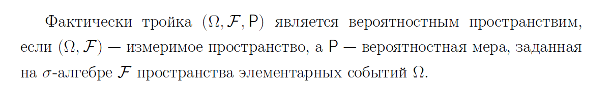

# 1. Основные понятия теории вероятностей: вероятностное пространство, событие, функция множества. Аксиомы теории вероятностей (по А.Н. Колмогорову). Свойство непрерывности вероятностной меры. 

## Основные понятия
**Пространством элементарных событий $\Omega$**  - совокупность всех возможных, неразложимых, взаимоисключающих реализаций эксперимента.  
Элементы $\omega \in \Omega$ называются *элементарными исходами*.

**Событие** - некоторое подмножество элементов пространства элементарных событий $\Omega$

**Множество всех событий** - некоторая совокупность F множеств из множества всех подмножеств пространства элементарных событий $\Omega$  

Множество событий должно быть замкнуто относительно: 
 - объединение
 - пересечение
 - дополнение

Аксиоматика теории вероятности идейно основывается на следующих принципах:
- все события полностью определяются «начальными условиями»; 
- неопределенность порождается недостатком информации о «начальных условиях». 

**Измеримое пространство** - пара $(\Omega, \mathrm{F})$, состоящая из множества $\Omega$ и $\sigma$-алгебры F

**Числовая функция** - функция со значением в R.

## **Аксимомы Колмагорова:**

## Вероятностное пространство
**Вероятностным пространством** назывется тройка $(\Omega, \mathrm{F}, \mathrm{P})$, где:

## Свойство непрерывности вероятностной меры
  
доказательство  

## Алгебра

## $\sigma$-алгебра

## Борелевская $\sigma$-алгебра

## Мера

## Вероятностная мера

