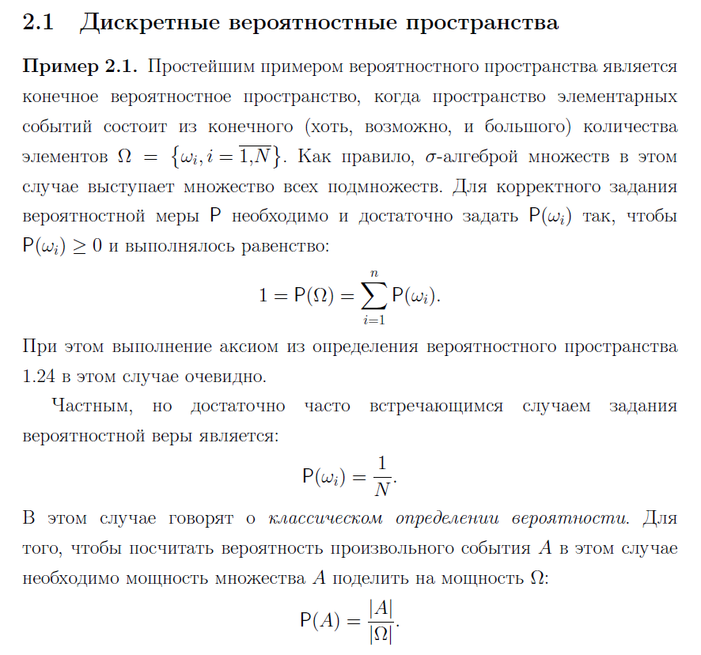

# 2. Дискретное вероятностное пространство и способы задания вероятностной меры на нём. Определение классической вероятности. Примеры. 

*Примеры:*
Пример дискретного в. п. являются вероятностные пространства описывающие:
 - эксперимент бросания игрального кубика
 - выбор случайного равновероятного ключа алгоритма шифрования из множества всех ключей.
